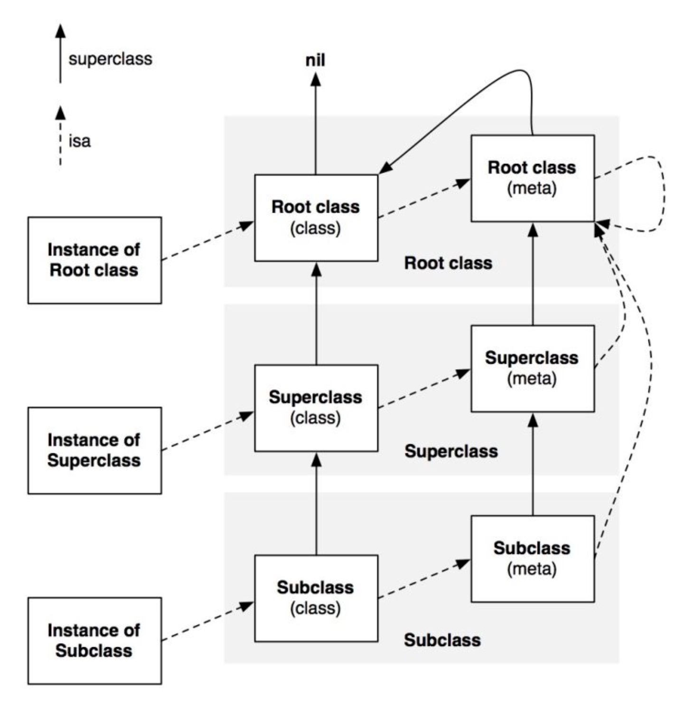

------ 高级篇 (5天)做部分优化

NSObject、Class内部结构、
SEL和IMP、
消息转发、
Method Swizzling
内存优化
Objective-C的RunTime

## Runtime基本概念

OC是一门动态语言，它将很多静态语言在编译和连接时做的事情放到了运行时候来处理。这也意味着，OC不仅仅需要一个编译器，而且需要一个运行时系统来执行编译的代码，即`Objc Runtime`。这个库是由C语言和汇编写的，正是这个库赋予了C语言面向对象的能力。

### 概述

`Runtime`库主要做了下面两件事情：
* 封装：在这个库中，对象可以用C语言中的结构体表示，方法可以用C语言函数来实现。这些结构体和函数被Runtime封装之后，我们可以在程序运行时创建、检查和修改类、对象和它们的方法。
* 找出方法的最终执行代码：当程序执行[obj dosomething]的时候，会向消息接受者（obj）发送一条消息（dosomething），runtime会根据消息接受者是否能响应该消息而做出不同的反应。

### 版本

目前主要有两个版本`Modern runtime`和`Legacy runtime`。前者覆盖了64位的MacOS和iOS，后者是早期给32位mac用的，这里不再深入了解。

### 几个概念

* Class：定义Objective-C的类
* ivar：定义对象的实例变量，包括类型和名字
* Method：定义对象方法或者类方法
* SEL：定义selector，是方法名的唯一标识符
* IMP：定义方法实现，是一个指向某个函数的指针

下面分几部分来了解Runtime。

## 类与对象

### 类

Objective-C类是由`Class`类型来表示的，它实际上是一个指向objc_class结构体的指针，
`typedef struct objc_class *Class`。

它的定义在`runtime.h`如下：
```
struct objc_class {
    Class isa  OBJC_ISA_AVAILABILITY;
#if !__OBJC2__
    Class super_class                   	OBJC2_UNAVAILABLE;	// 父类
    const char *name                      	OBJC2_UNAVAILABLE;	// 类名
    long version                          	OBJC2_UNAVAILABLE;	// 类的版本信息，默认为0，在对象序列化的时候很有用
    long info                            	OBJC2_UNAVAILABLE;	// 类信息，供运行期使用的一些位标识
    long instance_size                   	OBJC2_UNAVAILABLE;	// 该类的实例变量大小
    struct objc_ivar_list *ivars         	OBJC2_UNAVAILABLE;	// 该类的成员变量链表
    struct objc_method_list **methodLists 	OBJC2_UNAVAILABLE;	// 方法定义的链表
    struct objc_cache *cache              	OBJC2_UNAVAILABLE;	// 方法缓存，局部性原理
    struct objc_protocol_list *protocols 	OBJC2_UNAVAILABLE;	// 协议链表
#endif
} OBJC2_UNAVAILABLE;
```


> 除了isa指针，上面的结构体声明是OC1.0中的内容，可能是为了兼容考虑吧，OC2.0的runtime貌似没有完全开源呀 = = 

举个例子🌰：
```
NSArray *array = [[NSArray alloc] init];
```	
其流程是：
1. `[NSArray alloc]`先被执行。因为NSArray没有`+alloc`方法，于是去父类NSObject去查找。
2. 检测NSObject是否响应`+alloc`方法，发现响应，于是检测NSArray类，并根据其所需的内存空间大小开始分配内存空间，然后把`isa`指针指向NSArray类。同时，`+alloc`也被加进cache列表里面。
3. 接着，执行`-init`方法，如果NSArray响应该方法，则直接将其加入`cache`；如果不响应，则去父类查找。
4. 在后期的操作中，如果再以`[[NSArray alloc] init]`这种方式来创建数组，则会直接从cache中取出相应的方法，直接调用。

### 元类

所有的类本身也是一个对象，我们可以向这个对象发送消息，例如：
```
NSArray *array = [NSArray array];
```
它的`isa`指向元类（Meta-Class），在向NSArray发送消息的时候，会在它的meta-class方法列表中寻找。然后为了不要无限循环，Objective-C的设计者让所有的meta-class的isa指向基类的meta-class，以此作为它们的所属类。也就是任何NSObject继承体系下的meta-class都使用NSObject的meta-class作为自己的所属类，而基类的meta-class的isa指针是指向它自己。这样就形成了一个完美的闭环。


### 对象

`objc_object`是表示一个类的实例的结构体，它的定义如下(`objc/objc.h`)：
```
objc
struct objc_object {
    Class isa  OBJC_ISA_AVAILABILITY;
};
typedef struct objc_object *id;
```

可以看到，只有结构体里面只有一个指向类的`isa`指针。当我们向一个对象发送消息的时候，runtime库会根据`isa`指针去找到这个实例对象所属的类，然后在类的方法列表和父类的方法列表中寻找selector指向的对象。

当创建一个特定类的实例对象的时候，分配的内存包含了一个`objc_object`，然后是类的实例变量数。NSObject的`alloc`方法和`allocWithZone`方法使用函数`class_createInstance`来创建`objc_object`数据结构。

我们常见的`id`，实际上就是一个`objc_object`结构类型的指针，所以实现类似泛型这样的操作。

### 总结

在唐巧大神的博客里面看到这张图，很好的总结了上面的几点内容。




### 扩展：runtime动态创建类和对象

有点类似与Java里面的反射🤔

先看类的：

####  创建类

方法：
```
Class objc_allocateClassPair ( Class superclass, const char *name, size_t extraBytes );
```
参数：
* superclass 父类
* name 类的名字
* extraBytes 分配给类和元类对象尾部的索引ivars字节数，通常为0

#### 销毁类

方法：
```
void objc_disposeClassPair ( Class cls );
```
参数：
* cls：指定销毁类

#### 注册类

方法：
```
void objc_registerClassPair ( Class cls );
```
-----

为了创建一个新类，我们需要调用`objc_allocateClassPair`。然后使用诸如`class_addMethod`，`class_addIvar`等函数来为新创建的类添加方法、实例变量和属性等。完成这些后，我们需要调用`objc_registerClassPair`函数来注册类，之后这个新类就可以在程序中使用了。

-----

然后再看看对象的

#### 创建对象

方法：
```
id class_createInstance ( Class cls, size_t extraBytes )
```
参数：
* cls：类
* extraBytes：额外字节数

#### 销毁对象

方法：
```
void * objc_destructInstance ( id obj );
```

### 关联对象

假定我们想要动态地将一个Tap手势操作连接到任何UIView中，并且根据需要指定点击后的实际操作。这时候我们就可以将一个手势对象及操作的block对象关联到我们的UIView对象中。这项任务分两部分。首先，如果需要，我们要创建一个手势识别对象并将它及block做为关联对象。如下代码所示：

```
- (void)setTapActionWithBlock:(void (^)(void))block
{
	UITapGestureRecognizer *gesture = objc_getAssociatedObject(self, &kDTActionHandlerTapGestureKey);
 
	if (!gesture)
	{
		gesture = [[UITapGestureRecognizer alloc] initWithTarget:self action:@selector(__handleActionForTapGesture:)];
		[self addGestureRecognizer:gesture];
		objc_setAssociatedObject(self, &kDTActionHandlerTapGestureKey, gesture, OBJC_ASSOCIATION_RETAIN);
	}
	objc_setAssociatedObject(self, &kDTActionHandlerTapBlockKey, block, OBJC_ASSOCIATION_COPY);
}
```

这段代码检测了手势识别的关联对象。如果没有，则创建并建立关联关系。同时，将传入的块对象连接到指定的key上。注意`block`对象的关联内存管理策略。
手势识别对象需要一个`target`和`action`，所以接下来我们定义处理方法：

```
- (void)__handleActionForTapGesture:(UITapGestureRecognizer *)gesture
{
	if (gesture.state == UIGestureRecognizerStateRecognized)
	{
		void(^action)(void) = objc_getAssociatedObject(self, &kDTActionHandlerTapBlockKey);
		if (action)
		{
			action();
		}
	}
}
```

## 消息处理机制

### SEL

SEL又叫选择器，本质上是一个方法的`selector`的指针，定义如下：
```
typedef struct objc_selector *SEL;
```

OC在编译的时候，会根据每一个方法的名字、参数序列，生成一个唯一的整型标识（int类型的地址），这个标识就是SEL。

只要方法名相同，那么方法的SEL就是一样的，所以OC没有重载，不能存在两个同名的方法。不同的类可以拥有相同的SEL，因为不同类的实例对象在执行相同的selector时候，会在各自的方法列表中根据selector去寻找自己的IMP。

所有的SEL构成一个Set，也就是说SEL是唯一的。SEL就像是一个根据方法名hash了的KEY值，能够唯一代表一个方法，它的存在只是为了加快方法的查询速度。

获取selector主要下面三种方法：
* sel_registerName
* @selector()
* NSSelectorFromString

### IMP

IMP实际上是一个函数指针，指向方法实现的首地址，定义如下

```
id(*IMP)(id,SEL, ....)
```

第一个参数是指向`self`的指针（如果是类方法，指向元类的指针；如果是实例方法，指向类实例的内存地址），第二个参数是方法`SEL`，下面是方法的实际参数列表。

其实`SEL`就是为了查找方法的最终实现`IMP`的，由于每个方法对应唯一的`SEL`，我们可以通过`SEL`快速获取对应的`IMP`。通过`IMP`可以跳过Runtime的消息传递机制，直接执行`IMP`指向的函数实现，这样省去了Runtime消息传递过程中所做的一系列查找操作，会比直接向对象发送消息更高效。


### Method

有`SEL`和`SEL`之后，`Method`呼之欲出。`Method`用于表示类定义中的方法，定义如下：
```
typedef struct objc_method *Method;
struct objc_method {
    SEL method_name                	OBJC2_UNAVAILABLE;	// 方法名
    char *method_types                	OBJC2_UNAVAILABLE;
    IMP method_imp             			OBJC2_UNAVAILABLE;	// 方法实现
}
```
就很一目了然。

### 相关函数

```
// 调用指定方法的实现
id method_invoke ( id receiver, Method m, ... );
// 调用返回一个数据结构的方法的实现
void method_invoke_stret ( id receiver, Method m, ... );
// 获取方法名
SEL method_getName ( Method m );
// 返回方法的实现
IMP method_getImplementation ( Method m );
// 获取描述方法参数和返回值类型的字符串
const char * method_getTypeEncoding ( Method m );
// 获取方法的返回值类型的字符串
char * method_copyReturnType ( Method m );
// 获取方法的指定位置参数的类型字符串
char * method_copyArgumentType ( Method m, unsigned int index );
// 通过引用返回方法的返回值类型字符串
void method_getReturnType ( Method m, char *dst, size_t dst_len );
// 返回方法的参数的个数
unsigned int method_getNumberOfArguments ( Method m );
// 通过引用返回方法指定位置参数的类型字符串
void method_getArgumentType ( Method m, unsigned int index, char *dst, size_t dst_len );
// 返回指定方法的方法描述结构体
struct objc_method_description * method_getDescription ( Method m );
// 设置方法的实现
IMP method_setImplementation ( Method m, IMP imp );
// 交换两个方法的实现
void method_exchangeImplementations ( Method m1, Method m2 );

// 返回给定选择器指定的方法的名称
const char * sel_getName ( SEL sel );
// 在Objective-C Runtime系统中注册一个方法，将方法名映射到一个选择器，并返回这个选择器
SEL sel_registerName ( const char *str );
// 在Objective-C Runtime系统中注册一个方法
SEL sel_getUid ( const char *str );
// 比较两个选择器
BOOL sel_isEqual ( SEL lhs, SEL rhs );
```

### 方法调用流程

在OC中，消息直到运行的时候才绑定到方法的实现上面，编译器会将消息表达式`[receiver message]`转换为一个消息函数的调用，也就是`objc_msgSend`。

```
objc_msgSend(receiver,selector,arg1,arg2....)
```
这个函数完成了动态绑定的所有事情。


  


